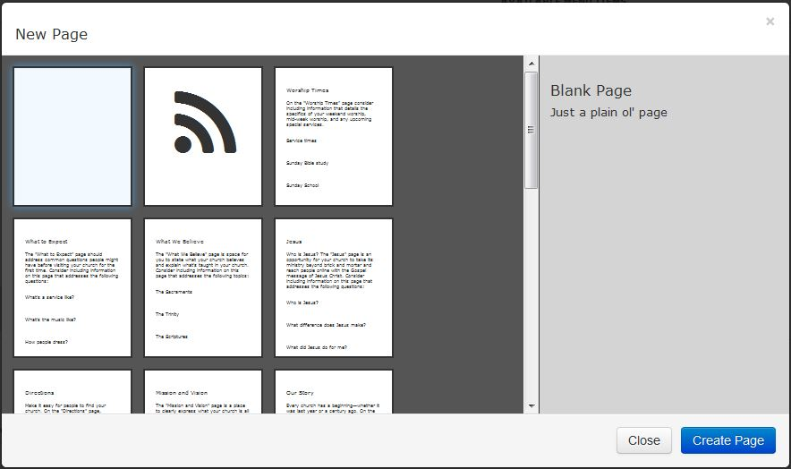

#Pages (Administrator/Publisher)

* Clicking on Pages allows us to make changes to our page.
* There are three sections:
   * Active Menu Items - Shows all active pages that are currently being used
   * Available Menu Items - Shows any pages that you have created.
   * Actions for Selected Pages
     * Add Category - allows us to add a new category to our pages
       * Add Page - allows us to add a new page
       * Publish - publishes the page so that others can view it
       * Make Draft -  changes the pages status to draft (not viewable to the public)
       * Delete - allows you to delete a page
       * Public -  makes the page public (viewable to everyone)
       * Private - makes the page private (viewable to members only)
* To add a new category we click on the Add Category Icon
       * When we click on this it adds a folder under the Active Menu Items
       * From here we give the folder a name and drag it to the appropriate menu item

  * To add a new page we click on the Add Page Icon
            * This will open a new window
      * We have a few options to choose from:
         * Blank Page - this is a blank page with no formatting set
         * Feed Page -  used for blogs
         * Static Pages - these are pages with different preset information already built in.
   * Once we have selected our page we click on Create Page to create that new page.
   * Once that is done it will take us to our newly created page to for editing. (Note: Edit Mode must be turned On)

  * Once our new page opens we will be able to chose the format of the page
  * There are six options that we can choose from:

  * Clicking on the Gear Icon will bring up an edit page which allows up to make some changes
   * URL - this allows us to change the name of the page (Not the URL)
   * Draft -  the page will not be available for others to view it while it is in draft status
   * Published - publishes the page so that others can view it

  * Once finished click on save changes to save the new page
