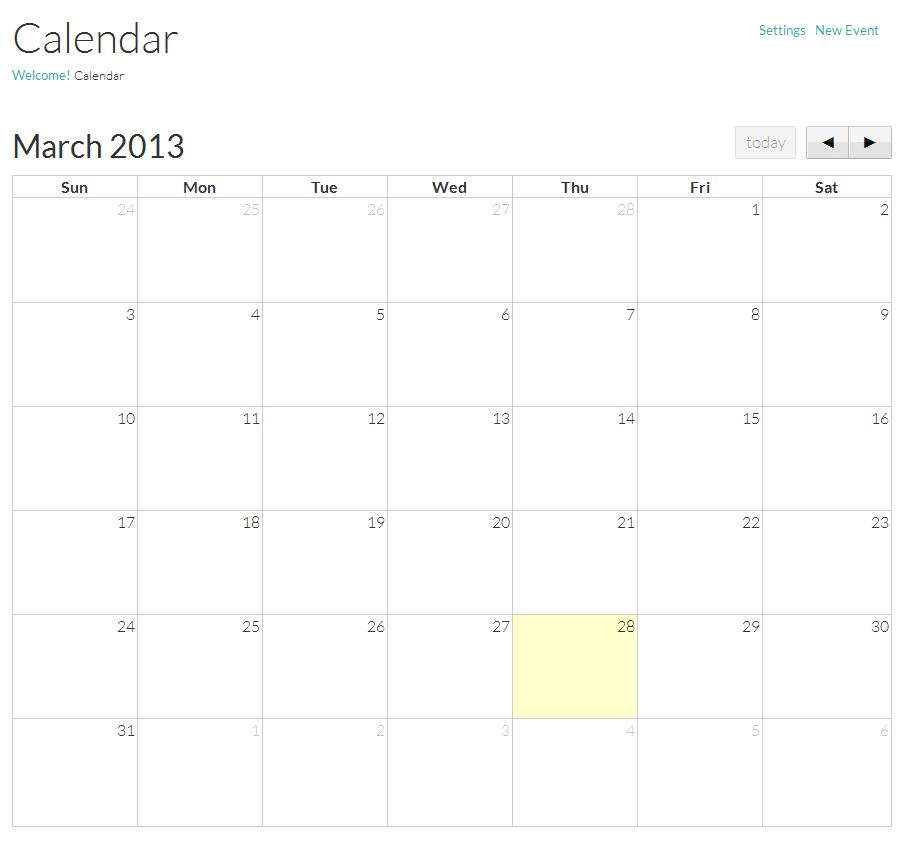
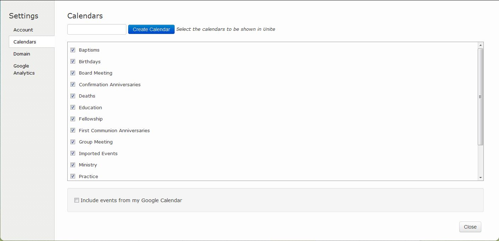
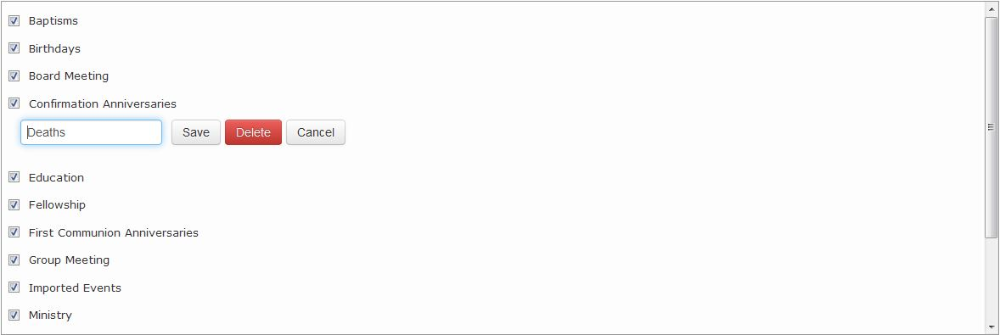
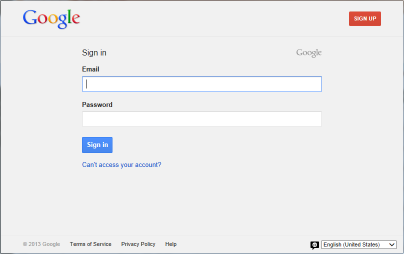
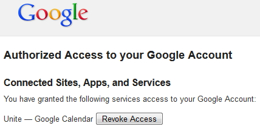
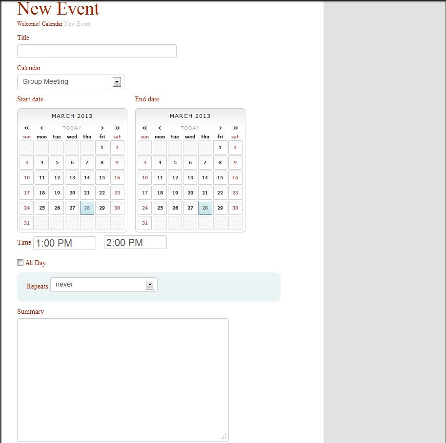

# Calendar Page

  * The Calendar Page displays any events that you have created within 360 Unite or events from your Church 360 Members and allows us to create new events.

   * Clicking on the Welcome Link will take you to your Welcome Page
   * Clicking on the Settings Link will take you to the Settings page
   * From here you will be able to select which Calendars you want to display.

   * Options Include
    * Baptisms
    * Birthdays
    * Board Meetings
    * Confirmation Anniversaries
    * Deaths
    * Education
    * Fellowship
    * First Communion Anniversaries
    * Group Meetings
    * Imported Events
    * Ministry
    * Visits
    * Wedding Anniversaries
    * Worship
    * Some Events can be deleted.  To do this you will click to the right of the Calendar you wish to delete then press delete.

* Calendars that are specific to Church 360 Members can not be deleted.

* You can also include Events from your Google Calendar
* Clicking on the Check-box will open a new window asking you to log in to your Google account.

* To remove Google Calendar Access from 360 Unite Site
* Log in to your Google Account
* Click on Accounts then click on Security
* Under Connected applications and sites Click on Review permissions
* Once you are on that screen Click on Revoke Access to remove Unite permission to your Google Calendar

* New events - used to create new events

* Title - enter the title of your new event
* Calendar - choose which Calendar that you want this event to display under
* Start Date/End Date - Choose the event start/end dates
* Time - choose the event time
* Repeats - choose whether or not the event repeats
* Summary - used to enter a summary for the event