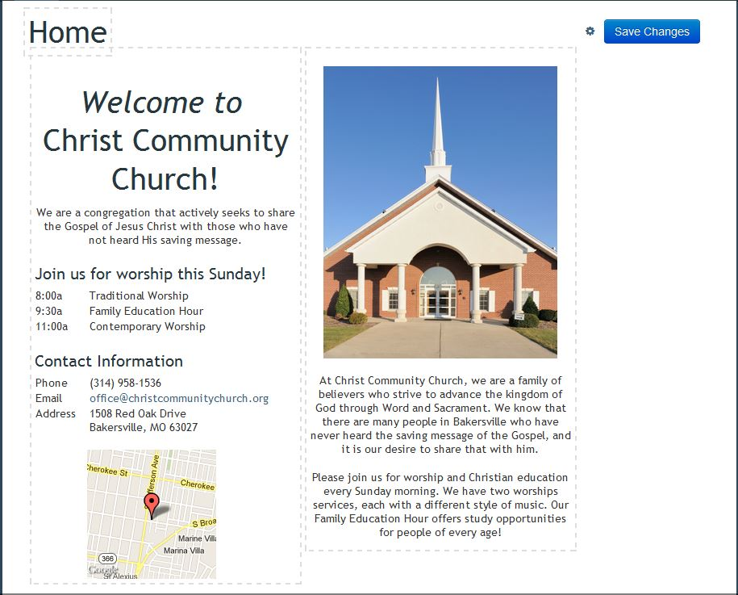

#Edit Mode

* Static Pages

* Layout - this allows us to change the layout of the page.
      * There are six options to chose from

* We can use the editor to make changes to our pages.  Clicking in any of the boxes will allow you to edit the information in that box  

* Page Settings

* URL - allows you to change the page slug
* Status - shows the status of the page
 * Draft - not viewable to the public
 * Published - viewable by everyone

* Feed Page

* The only part that is able to be edited on a feed page is the page name.
