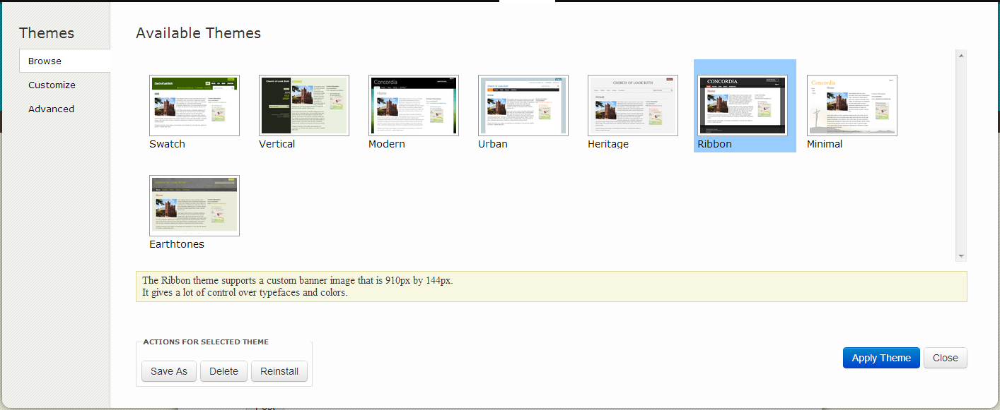
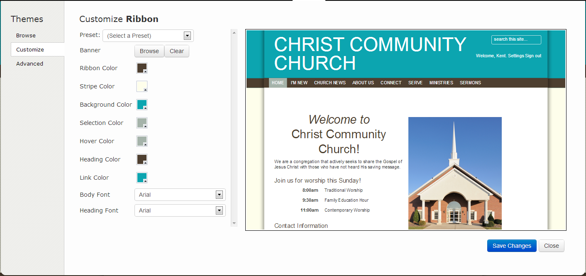
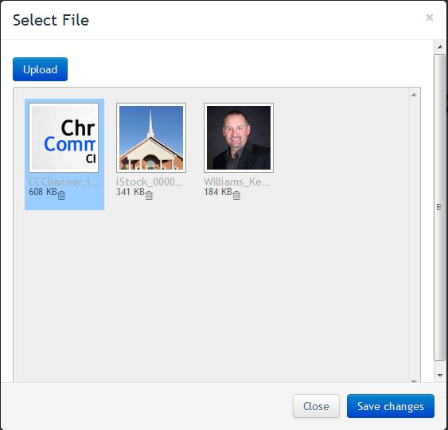
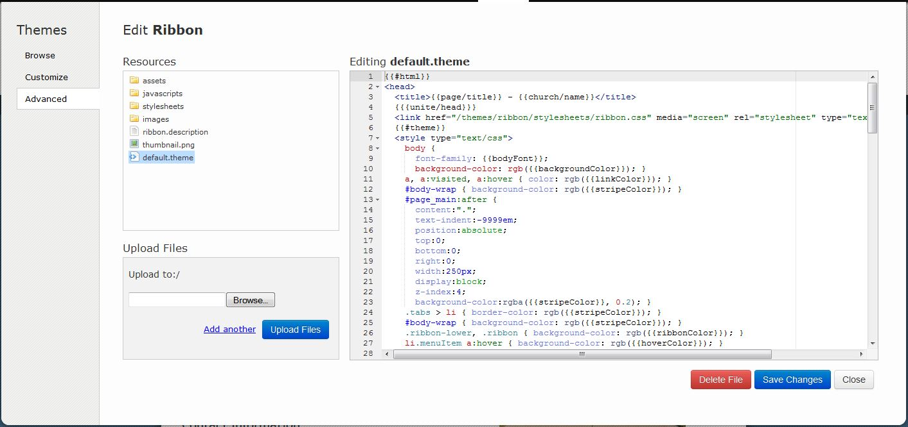

# Themes (Administrator Only)

 * Browse - shows the available themes that can be selected
  * Actions for selected theme
  * Save As - saves changes made to the theme
  * Delete - deletes that theme
  * Reinstall - re installs the selected theme
 * Customize - allows you to customize the selected theme

* Presets - allows you to choose between several preset conditions (Note: only certain themes contain presets)
* Banner - allows you to add a banner image
    * Browser - will open a new window that will allow you to select your banner image (Note: only certain themes have this option)
    * We also have to option to drag and drop files as well

* Customization options: (uses a color wheel to set the colors)
  * Ribbon Color
  * Stripe Color
  * Background Color
  * Selection Color
  * Hover Color
  * Heading Color
  * Link Color
  * Body Font
  * Heading Font

* Advanced Options - allows you to make changes to the selected theme

* Resources - shows the files/folders that are related to theme (depends on the selected theme)
   * Assets Folder - displays an assets that you have uploaded (Banner Images)
   * JavaScript Folder - displays the scripts for the selected theme
   * Stylesheets - displays the CSS for the selected theme
   * Images - displays and images that are being used in the selected theme
   * Files - includes any associated files that are related to the selected theme (layout, png, description files)
* Upload Files - allows you to upload files (Can upload it to any folders that are available or resources) 
* Save Changes - saves any changes that you have made